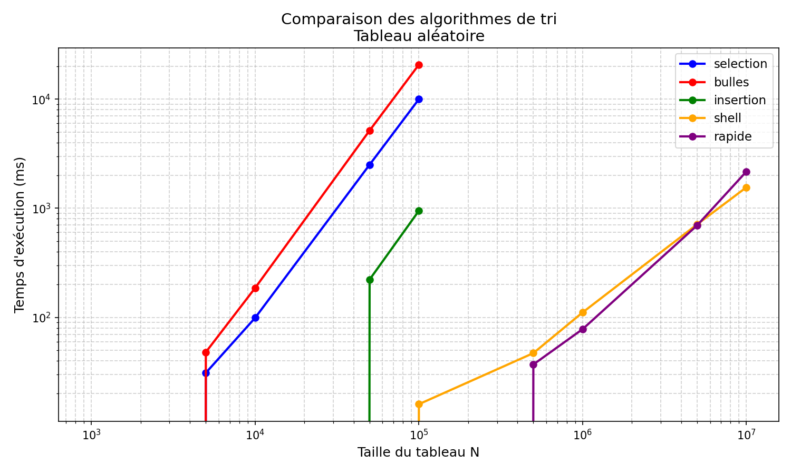
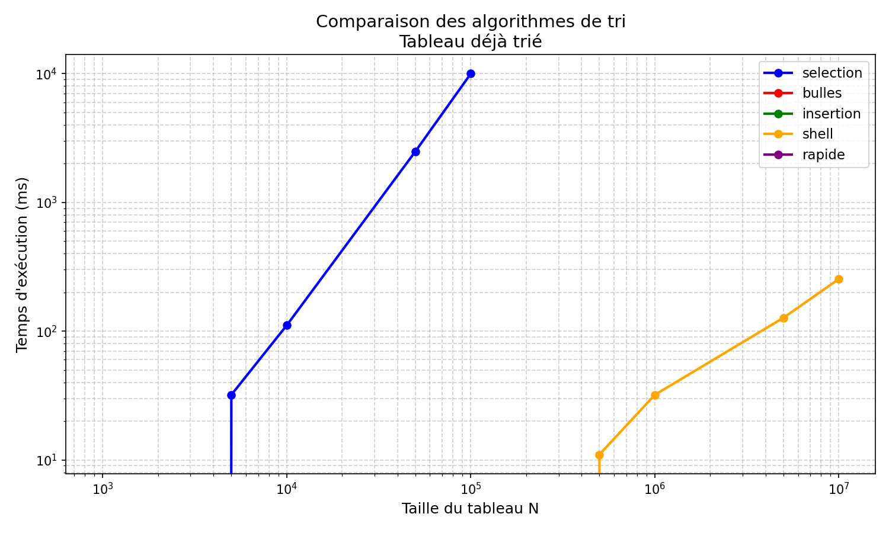
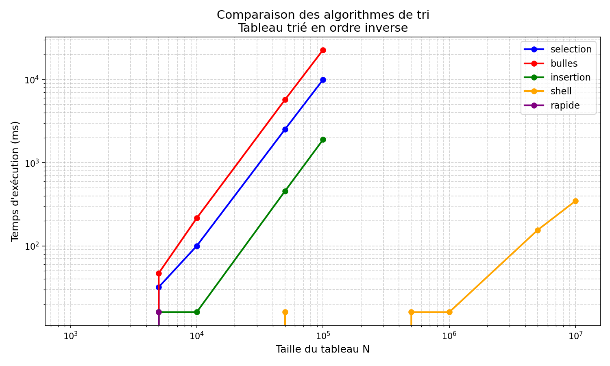

# Rapport : Comparaison d'algorithmes de tri

**Module :** Problem Solving  
**Auteur :** Saifeddine Triki & Salmen Zekri
**Date :** Avril 2026

---

## 1. Introduction

L'objectif de ce projet est de comparer expérimentalement les performances de cinq algorithmes de tri classiques en C : le tri par sélection, le tri à bulles, le tri par insertion, le tri Shell et le tri rapide. La comparaison se base sur le temps d'exécution mesuré pour des tableaux de taille N croissante (de 1 000 à 10 millions d'éléments), et pour trois types d'entrée : tableau aléatoire, tableau déjà trié et tableau trié en ordre inverse.

---

## 2. Présentation des algorithmes de tri

### 2.1 Tri par sélection

Le tri par sélection parcourt le tableau et, à chaque étape, cherche le minimum dans la partie non encore triée pour le placer à sa position finale.

- **Complexité :** O(n²) dans tous les cas (peu importe l'ordre initial).
- **Avantage :** simple à comprendre et à implémenter.
- **Inconvénient :** très lent pour les grands tableaux.

### 2.2 Tri à bulles

Le tri à bulles compare chaque paire d'éléments adjacents et les échange s'ils sont dans le mauvais ordre. On répète jusqu'à ce que le tableau soit trié.

- **Complexité :** O(n²) en moyenne et dans le pire cas ; O(n) si le tableau est déjà trié (avec l'optimisation de l'indicateur d'échange).
- **Avantage :** détecte rapidement un tableau déjà trié.
- **Inconvénient :** un des algorithmes les plus lents en pratique.

### 2.3 Tri par insertion

Le tri par insertion maintient une partie gauche triée et insère chaque nouvel élément à sa bonne place en décalant les éléments plus grands.

- **Complexité :** O(n²) en moyenne ; O(n) si le tableau est déjà trié.
- **Avantage :** très efficace sur des tableaux presque triés ou de petite taille.
- **Inconvénient :** lent pour les grands tableaux désordonnés.

### 2.4 Tri Shell

Le tri Shell est une amélioration du tri par insertion. Il trie d'abord des sous-séquences d'éléments espacés d'un « gap », puis réduit progressivement ce gap jusqu'à 1. Cela permet de déplacer les éléments rapidement vers leur position finale.

On utilise la séquence de gaps classique : n/2, n/4, …, 1.

- **Complexité :** difficile à analyser précisément, mais bien meilleure que O(n²) en pratique.
- **Avantage :** nettement plus rapide que les tris en O(n²), sans la complexité du tri rapide.
- **Inconvénient :** les performances dépendent de la séquence de gaps choisie.

### 2.5 Tri rapide (Quicksort)

Le tri rapide choisit un élément pivot, partitionne le tableau en deux parties (éléments plus petits à gauche, plus grands à droite), puis trie récursivement chaque partie.

Dans cette implémentation, le pivot est le **dernier élément** du tableau, ce qui est l'approche classique enseignée en cours.

- **Complexité :** O(n log n) en moyenne ; O(n²) dans le pire cas (tableau déjà trié ou trié en inverse avec pivot = dernier élément).
- **Avantage :** très rapide en pratique pour les tableaux aléatoires.
- **Inconvénient :** performances dégradées sur les tableaux déjà triés avec ce choix de pivot.

---

## 3. Implémentation

### 3.1 Architecture du code

Le projet est organisé en trois fichiers C et un script Python :

| Fichier | Rôle |
|---|---|
| `tri.h` | Déclarations (prototypes) des 5 fonctions de tri |
| `tri.c` | Implémentations des 5 algorithmes avec commentaires |
| `main.c` | Boucle de benchmark, chronométrage, affichage et CSV |
| `plot.py` | Lecture du CSV et génération des courbes |

### 3.2 Chronométrage

Le temps d'exécution est mesuré avec la fonction `clock()` de la bibliothèque standard C (`<time.h>`) :

```c
clock_t debut = clock();
tri_selection(copie, n);
clock_t fin = clock();
double duree_ms = (double)(fin - debut) / CLOCKS_PER_SEC * 1000.0;
```

`clock()` mesure le temps CPU consommé par le processus, exprimé en millisecondes dans notre code.

### 3.3 Copies de tableaux

Pour que chaque algorithme trie les mêmes données de départ, on crée une copie du tableau de base avec `memcpy` avant chaque mesure. Cela garantit que les résultats ne dépendent pas de l'ordre dans lequel les algorithmes sont exécutés.

### 3.4 Seuil pour les algorithmes lents

Les algorithmes O(n²) (sélection, bulles, insertion) sont ignorés pour N > 100 000, car leur temps d'exécution deviendrait excessivement long (plusieurs dizaines de minutes). Dans le fichier CSV, ces entrées sont marquées avec la valeur -1.

Le tri rapide est également ignoré pour les tableaux triés et inverses dès N > 100 000, car le choix du pivot (dernier élément) le fait dégénérer en O(n²).

---

## 4. Configuration de la machine

Les mesures ont été réalisées sur la machine suivante :

| Paramètre | Valeur |
|---|---|
| Système d'exploitation | Windows 11 Famille Unilingue (10.0.26200) |
| Processeur | Intel Core i5-9300H @ 2.40 GHz |
| Mémoire RAM | 16 Go |
| Compilateur | GCC 15.2.0 (MSYS2) |
| Options de compilation | `-O2 -Wall` |

---

## 5. Résultats et courbes

### 5.1 Tableau aléatoire



Pour un tableau rempli aléatoirement, on observe clairement deux groupes de courbes :
- Les algorithmes O(n²) (sélection, bulles, insertion) voient leur temps croître très rapidement avec N.
- Le tri Shell et le tri rapide restent beaucoup plus rapides, avec une croissance quasi logarithmique.

Le tri rapide est le plus performant sur ce type d'entrée.

### 5.2 Tableau déjà trié



Sur un tableau déjà trié :
- Le tri par insertion et le tri à bulles (grâce à l'optimisation de l'indicateur d'échange) sont très efficaces : O(n).
- Le tri rapide, en revanche, dégénère car le pivot est toujours le plus grand élément, ce qui crée une partition déséquilibrée (O(n²)).
- Le tri par sélection n'est pas amélioré par l'ordre des données : il reste en O(n²).

### 5.3 Tableau trié en ordre inverse



Le tableau inversé représente le pire cas pour la plupart des algorithmes O(n²) :
- Le tri à bulles effectue le maximum d'échanges.
- Le tri par insertion doit décaler tous les éléments à chaque insertion.
- Le tri rapide dégénère aussi (même raison que pour le tableau trié).
- Le tri Shell reste stable et performant quel que soit l'ordre initial.

---

## 6. Conclusion

Cette étude confirme les analyses théoriques :

- Les algorithmes O(n²) (sélection, bulles, insertion) deviennent très rapidement inutilisables pour des grandes données. Ils ne sont adaptés qu'à des petits tableaux (N < 10 000).
- Le tri par insertion est particulièrement efficace pour les tableaux déjà triés ou presque triés.
- Le tri Shell offre un bon compromis : plus simple que le tri rapide, mais bien plus rapide que les tris en O(n²).
- Le tri rapide est globalement le plus performant pour des données aléatoires, mais son comportement dépend fortement du choix du pivot.

En pratique, les bibliothèques standard (comme `qsort` en C) utilisent des variantes hybrides du tri rapide pour éviter ses cas dégénérés.
